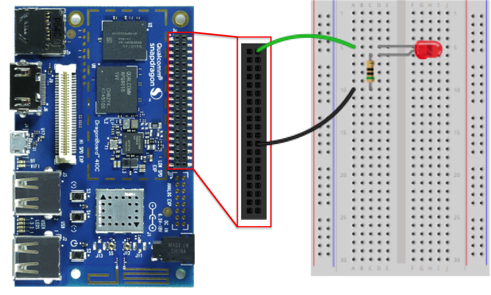

# Introduction
The <font class="dragon_font">Dragon</font>Connect example includes the ability
to manage an LED.  You will need the following components to complete the
circuit

* A breadboard
* Wire
* LED
* 50 m&#x2126; resistor

## Circuit

**NOTE:** Please ensure that your <font class="dragon_font">Dragon</font>Board
is powered off and the power supply has been disconnected from the
<font class="dragon_font">Dragon</font>Board.  This is a good practice
that will help reduce the chances of an accidental short circuit that could
damage your single board computer.

Follow the steps below to complete the circuit

* Connect one end of the wire from the GPIO 12 (positive) position to a row (m)
  in the breadboard
* Connect one end of the resistor in the same row as the wire from GPIO 12 (m)
* Connect the other end of the resistor to to a different row (n)
* Connect the anode of the LED in the same row (n)
* Connect the cathode of the LED to a different row (o)
* Connect the ground from the GPIO (pin 2) to the row with the LED cathode (o)

Your circuit should look similar to the following



## Design
The LED is managed using the _API Gateway_, _Lambda_, and _IoT_ services and
is composed of retrieving the status of the device shadow and requesting an
update of its state.

### Status Retrieval
Let's begin by understanding how the status of the LED is retrieved.
The following diagram provides an overview of the status retrieval


The browser issues a GET on the resource /things/{thingId}/led.  The _API
Gateway_ is configured to invoke the DragonConnect-led _Lambda_ function.
The DragonConnect-led _Lambda_ performs the following steps

1. Validates that a thing is in _IoT_ Thing Registry and is assigned a
   principal (certificate)
1. Retrieves the reported state from the _IoT_ Device Shadow.  The
   _IoT_ device shadow provides the reported state in a document similar to

    ```json
    {
    	"state": {
    		"desired": {
    			"active": true
    		},
    		"reported": {
    			"active": true
    		}
    	},
    	"metadata": {
    		"desired": {
    			"active": {
    				"timestamp": 1451516587
    			}
    		},
    		"reported": {
    			"active": {
    				"timestamp": 1451516635
    			}
    		}
    	},
    	"version": 50,
    	"timestamp": 1451592857
    }
    ```

1.  The DragonConnect-led _Lambda_ function transforms the response into
    the simple document of

    ```json
    {
      "active": true
    }
    ```

## State Update

A request to update the state of the LED is made through a web browser when
a user selects the desired state.  Logic in the web client controls the
possible selection.  If a device has not reported state, ...

When a user selects a state, the following steps in the following diagram
occur


1.  The web browser performs a POST to the resource /things/{thingId}/led
    through the _API Gateway_.
1.  The _API Gateway_ is configured to invoke the DragonConnect-led
    _Lambda_ function with the desired state.
1.  The _Lambda_ function requests an update to the thing state using the
    Device Shadow.  Assuming that a user has requested to turn off the LED
    the desired state is false

    ```json
    {
      "state": {
        "desired": {
          "active": false
        }
      }
    }
    ```

1.  Meanwhile, when the <font class="dragon_font">Dragon</font>Connect client
    starts it subscribes to the topic $aws/things/{thingId}/shadow/update/delta.
    When the desired state is set through the previous step, the _IoT_
    service publishes a method to the aforementioned topic.  The client
    receives the message.
1.  Once the message has been received, the
    <font class="dragon_font">Dragon</font>Connect client activates the
    configured General Purpose IO (GPIO) pin.
1.  Finally, the <font class="dragon_font">Dragon</font>Connect client
    publishes a method to the Device Shadow topic of
    $aws/things/{thingId}/shadow/update as shown in the diagram below


